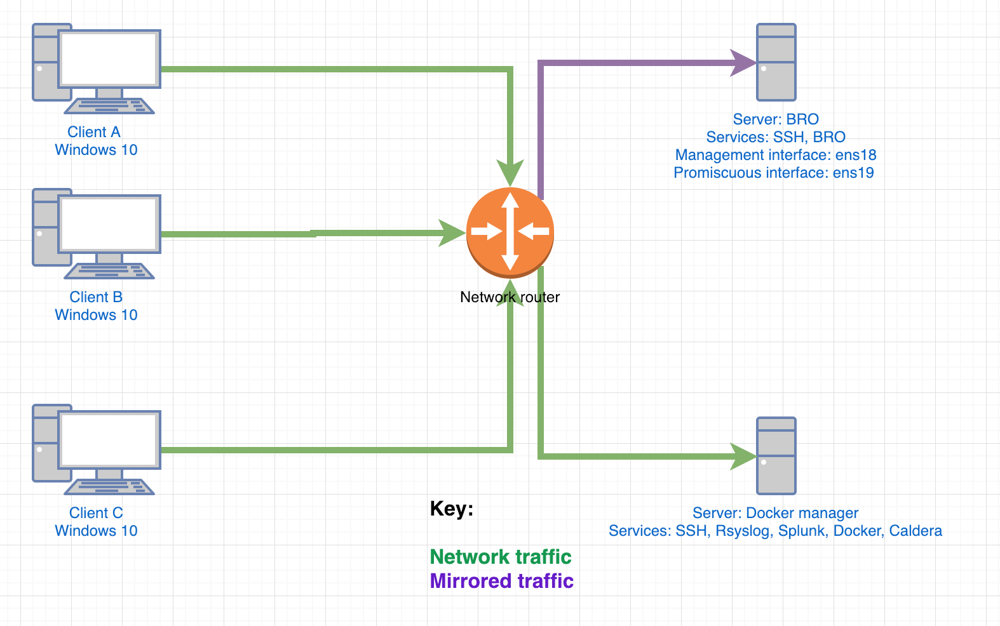

# Setup Caldera

[CALDERA](https://github.com/mitre/caldera) is an automated adversary emulation system that performs post-compromise adversarial behavior within Windows Enterprise networks. It generates plans during operation using a planning system and a pre-configured adversary model based on the Adversarial Tactics, Techniques & Common Knowledge (ATT&CK™) project. These features allow CALDERA to dynamically operate over a set of systems using variable behavior, which better represents how human adversaries perform operations than systems that follow prescribed sequences of actions.

CALDERA is useful for defenders who want to generate real data that represents how an adversary would typically behave within their networks. Since CALDERA's knowledge about a network is gathered during its operation and is used to drive its use of techniques to reach a goal, defenders can get a glimpse into how the intrinsic security dependencies of their network allow an adversary to be successful. CALDERA is useful for identifying new data sources, creating and refining behavioral-based intrusion detection analytics, testing defenses and security configurations, and generating experience for training.

BlackHat Europe 2017 presentation slides: CALDERA - Automating Adversary Emulation

## Network diagram

## Install/Setup Caldera with Docker

1. vim hosts.yml and under "[caldera]" set:
    1. ansible_host - Set to IP addr of remote host
1. `ansible-playbook -i hosts.yml deploy_caldera.yml -u superadmin`

## Access WebGUI

1. `https://<Docker IP addr>:8888`
    1. Username: `admin`
    1. Password: `caldera`

## Resources/Sources

### Caldera

* [GitHub - Caldera](https://github.com/mitre/caldera)
* [ReadTheDocs - Caldera](https://caldera.readthedocs.io/en/latest/)
* [INSTALL/SETUP MITRE CALDERA THE AUTOMATED CYBER ADVERSARY EMULATION SYSTEM](https://holdmybeersecurity.com/2018/01/13/install-setup-mitre-caldera-the-automated-cyber-adversary-emulation-system/)