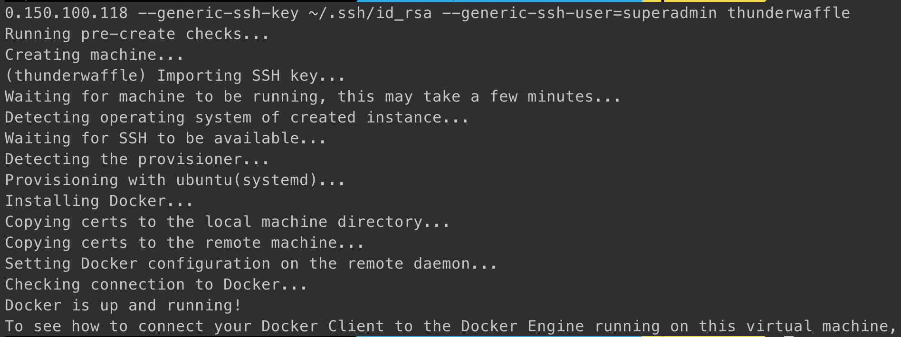

# Docker Swarm

## Install/Setup Docker Swarm

1. `mv group_vars/docker.example group_vars/docker.yml`
1. `vim group_vars/docker.yml` and set:
    1. `docker_path` - Path for docker to store persistent data
        1. Default path `/srv/docker/<container>`
1. `vim hosts.yml` and under "[docker]" set:
    1. ansible_host - Set to IP addr of remote host
1. `ssh-copy-id <username>@<docker host>`
1. `ansible-playbook -i hosts.yml deploy_docker.yml -u <username> -K`
    1. `-K` will prompt for user's password

## Connect to Docker Swarm on Linux/MacOS

1. `docker-machine create --driver generic --generic-ip-address=<Docker IP addr> --generic-ssh-key ~/.ssh/id_rsa --generic-ssh-user=<username> <hostname>`
1. 
1. `eval $(docker-machine env <hostname>)`

## Resources/Sources

### Docker

* [Connect your Docker client to a remote Docker host](https://www.kevinkuszyk.com/2016/11/28/connect-your-docker-client-to-a-remote-docker-host/)
* [Github - Setup Docker](https://raw.githubusercontent.com/CptOfEvilMinions/GuardiansOfTheNetwork/master/Setup/roles/docker/setup_docker.yml)