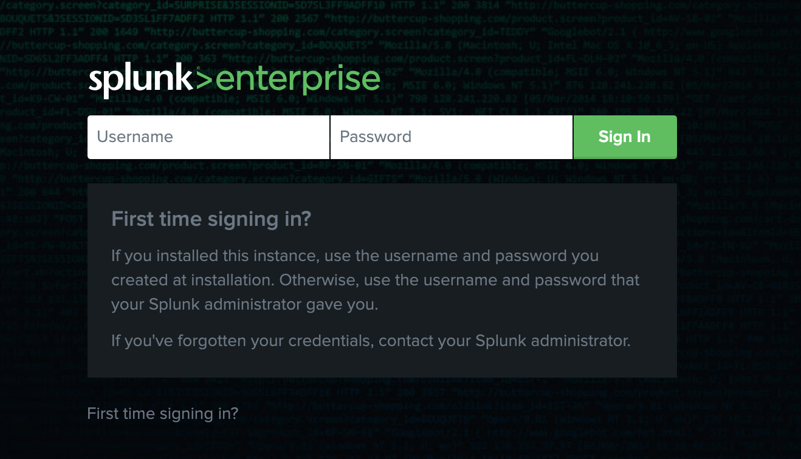
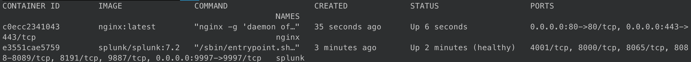
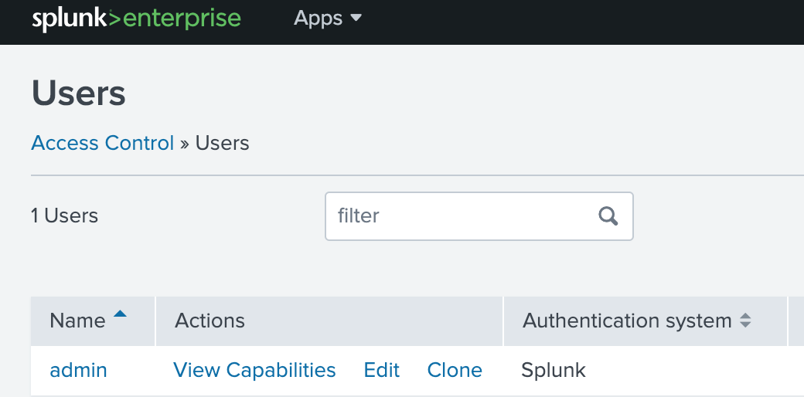
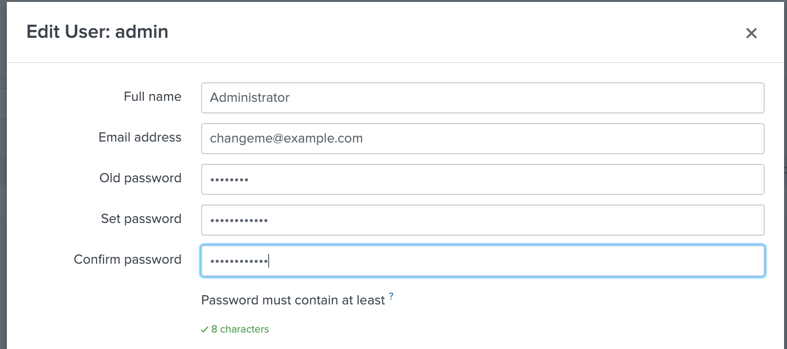
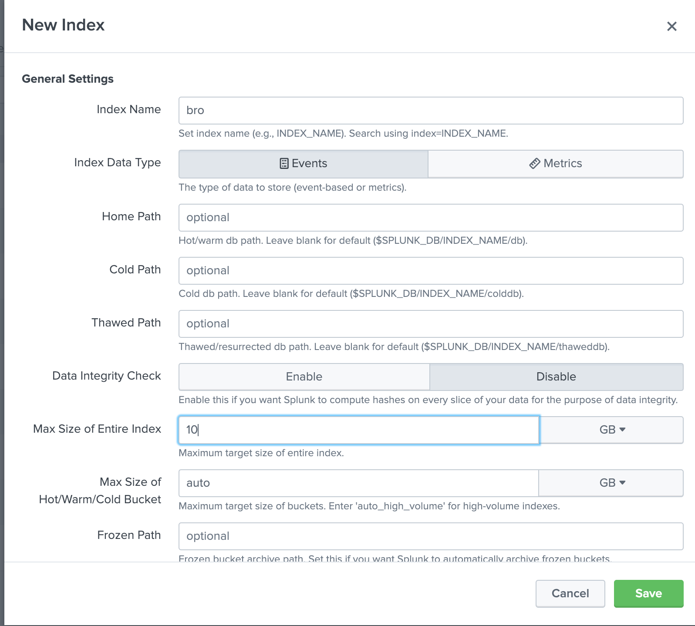

# Setup Splunk

## Setup Splunk server on Docker

1. vim hosts.yml and under "[splunk]" set:
    1. ansible_host - Set to IP addr of remote host
1. `ansible-playbook -i hosts.yml deploy_splunk.yml -u <username> -K`
1. Browse `https://<Docker IP addr>` and login
    1. Docker container runs an Ansible script which takes about ~2mins to run
    1. User: admin
    1. Pass: changeme
    1. 
1. `docker ps`
1. 

### Change password

1. Select the "Settings" tab at the top then select "Acess Control" under "User and authentication"
1. Select "Users"
1. 
1. Select "Edit" under "Actions" for admin user
    1. Enter old password
    1. Enter new password
    1. Select "save"
1. 

### Create BRO index

1. Select "Settings" then "Indexes" under "Data"
1. Select "New index" in top right
    1. Enter `bro` for Index name
    1. Enter `10` for max size of entire index
    1. 

### Adding Bro Add-on

1. [Splunk Add-on for Zeek aka Bro](https://splunkbase.splunk.com/app/1617/)

## Resources/Sources

### Splunk

* [Splunk Download](https://www.splunk.com/en_us/download)
* [How to Install Splunk on Ubuntu 18.04](https://linoxide.com/linux-how-to/install-splunk-ubuntu/)
* [Splunk SystemD file](https://answers.splunk.com/answers/59662/is-there-a-systemd-unit-file-for-splunk.html)