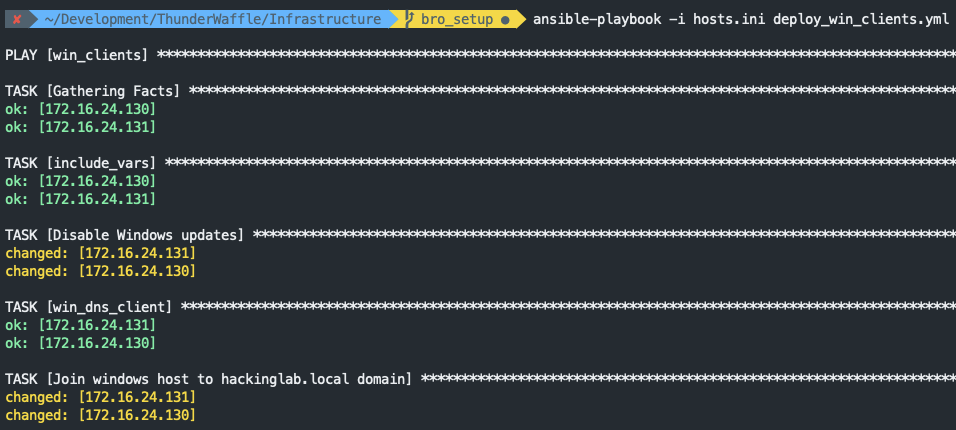

# Windows client

## Init Windows clients
0. Create Windows Server 10 VM
0. Start VM
0. Login
0. Open Powershell as Administrator
0. Enter `powershell -NoProfile -ExecutionPolicy Bypass -Command "iex ((new-object net.webclient).DownloadString('https://raw.githubusercontent.com/ansible/ansible/devel/examples/scripts/ConfigureRemotingForAnsible.ps1'))"`
0. Open "Network and sharing center"
0. Right-click the primary interface and select "Properties"
0. Double-click "Internet Protocol 4 (TCP/IP)"
    1. Enter "172.16.24.[130,131Sa]" for the IP address
    1. Enter "255.255.255.0" for the netmask
    1. Enter "172.16.24.254" for gateway
    1. Enter "172.16.24.253" for DNS 1
    1. Select "Ok"
0. Open "System settings"
    1. Select "Change settings"
    1. Select "Change" to rename this computer
    1. Enter "[Saturn, Jupiter] into computer name
0. Restart PC

## Deploy Windows clients
0. `vim hosts.ini` and set
    1. Add the domain controller IP address under "win_clients"
0. `ansible-playbook -i hosts.ini deploy_win_clients.yml`
    1. 

## References