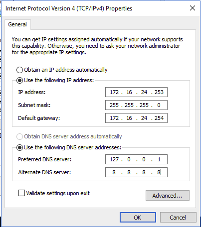
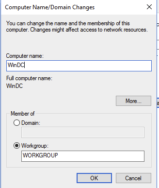
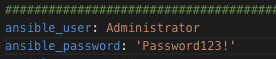
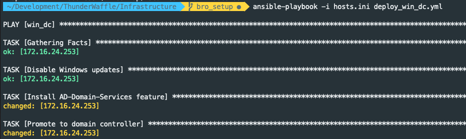

# Windows Domain Controller

## Init domain controller
0. Create Windows Server 2016 VM
0. Start VM
0. Login
0. Open "Network and sharing center"
0. Right-click the primary interface and select "Properties"
0. Double-click "Internet Procol 4 (TCP/IP)"
    1. Enter "172.16.24.253" for the IP address
    1. Enter "255.255.255.0" for the netmask
    1. Enter "172.16.24.254" for gateway
    1. Enter "127.0.0.1" for DNS 1
    1. Enter "8.8.8.8" for DNS 2
    1. 
    1. Select "Ok"
0. Open "System settings"
0. Select "Change settings"
0. Select "Change" to rename this computer
0. Enter "WinDC" into computer name
    1. 
0. Open Powershell as Administrator
0. Enter `powershell -NoProfile -ExecutionPolicy Bypass -Command "iex ((new-object net.webclient).DownloadString('https://raw.githubusercontent.com/ansible/ansible/devel/examples/scripts/ConfigureRemotingForAnsible.ps1'))"`
0. Restart PC

## Install Ansible on macOS
0. `brew update`
0. `brew install python3 python3-pip winrm`
0. `pip3 install ansible`

## Install/Setup Windows domain controller
0. `mv group_vars/all.yml.example group_vars/all.yml` and set:
    1. Set "base_domain" to a domain of your choosing
    1. Set "timezone" to a timezone of your choosing
    1. 
0. `vim hosts.ini` and set:
    1. Add the domain controller IP address under "win_dc"
0. 
0. `ansible-playbook -i hosts.ini deploy_win_dc.yml`
    1. 

## References
* [Github - CptOfEvilMinions/ThunderWaffle](https://github.com/CptOfEvilMinions/ThunderWaffle)
* [Ansible - win_service](https://docs.ansible.com/ansible/latest/modules/win_service_module.html)
* [Setting up a Remote WMI Connection](https://docs.microsoft.com/en-us/windows/win32/wmisdk/connecting-to-wmi-remotely-starting-with-vista)
* [An Introduction to SMB for Network Security Analysts](https://401trg.com/an-introduction-to-smb-for-network-security-analysts/)